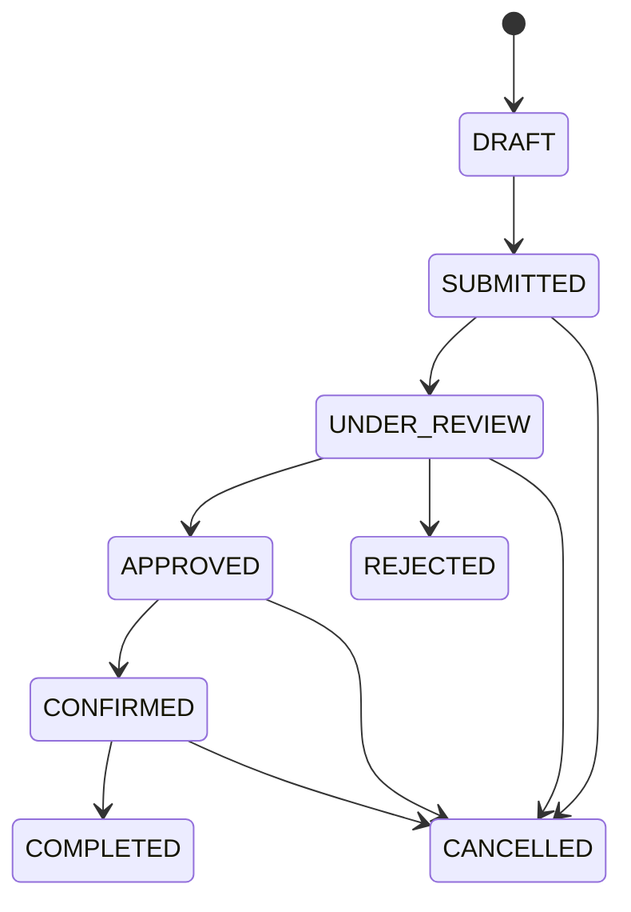

# Event Requests — Sprint 1 scope

> See [the integration guide](event-request-integration.md) for shared
> authentication, `/events/new`, runtime configuration and test commands.

## Scrum tickets

| ID | User story |
| --- | --- |
| Scrum-23 | As an Event Organiser, I want to create an event request containing the information ConnectSphere needs so that my event can be planned. |
| Scrum-25 | As an Event Organiser, I want to submit my event request so that it can be assigned to an Event Coordinator. |

Acceptance criteria Scrum-44 to Scrum-47 sit under Scrum-23; Scrum-49 to
Scrum-51 sit under Scrum-25. Epic Scrum-7.

### Scrum-23 — Create an event request

- An Event Organiser can provide the event name, purpose and description.
- The Organiser can provide the proposed date and time and the expected attendance.
- The Organiser can optionally set when registration opens and closes.
- The Organiser can provide venue requirements and accessibility needs.
- The Organiser can provide equipment and registration needs where relevant.

### Scrum-25 — Submit the event request

- A submitted request is stored and is not treated as a draft.
- The submitted request becomes available for coordinator assignment and subsequent review.
- The event status reflects that the request has been submitted.

The form submits directly to `SUBMITTED` in one action. Saving a draft and
returning to it later is US-13 and is not part of this sprint, so no `DRAFT`
row is ever written here.

---

## Role-scoped review and planning

Organisers see their own requests; coordinators see only their assigned active
events and the requests they rejected. Managers assign and reassign coordinators but do not decide: the assigned
coordinator approves or rejects (SCRUM-98/99). Venue and equipment arrangements
need an approved event. Only attendees can browse the registration catalogue.
See [event access](event-access.md) for the complete workflow and API contract.

## Database

The `events` table. There is no migration file for this table; it is maintained
in the Supabase dashboard and shared by the Venue, Equipment, Registration and
Assignment features.

```sql
create table events (
  id                  uuid primary key default gen_random_uuid(),
  name                text not null,
  purpose             text,
  description         text,
  start_time          timestamptz,
  end_time            timestamptz,
  registration_start  timestamptz, -- optional registration opening time
  registration_end    timestamptz, -- optional registration closing time
  expected_attendance integer,
  venue_requirements  text,        -- free text; read by the venue feature
  accessibility_needs text,
  equipment_needs     text,        -- free text; read by the equipment feature
  other_comments      text,
  registration_fields jsonb,       -- owned by the registration feature
  status              text not null default 'DRAFT',
  organiser_id        uuid not null,
  coordinator_id      uuid,        -- set by coordinator assignment
  submitted_at        timestamptz,
  approved_rejected_by      uuid,        -- SCRUM-98/99: coordinator who approved or rejected
  approved_rejected_at      timestamptz, -- SCRUM-98/99: when
  approval_rejection_remark text,        -- SCRUM-98/99: required on reject, optional on approve
  created_at          timestamptz not null default now()
);
```

### Status values

SCRUM-97 defines the eight statuses and the permitted moves between them in
`backend/src/modules/events/lifecycle.js`. The live `events_status_check`
constraint accepts all eight; it was changed by hand in the Supabase dashboard
on 2026-09-27 (no migration file) with:

```sql
alter table public.events drop constraint if exists events_status_check;
alter table public.events
  add constraint events_status_check check (status in (
    'DRAFT', 'SUBMITTED', 'UNDER_REVIEW', 'APPROVED',
    'CONFIRMED', 'COMPLETED', 'CANCELLED', 'REJECTED'
  ));
```



| Status | Badge label | Set by today |
| --- | --- | --- |
| `DRAFT` | Draft | nothing (column default; US-13) |
| `SUBMITTED` | Submitted | `createSubmitted`, at insert |
| `UNDER_REVIEW` | Under review | the assigned coordinator's *Start review* (SCRUM-98) |
| `APPROVED` | Approved – planning | the assigned coordinator's *Approve* (SCRUM-99); read by registration and venue |
| `CONFIRMED` | Confirmed | not yet (confirm story) |
| `COMPLETED` | Completed | not yet (complete story) |
| `CANCELLED` | Cancelled | not yet (cancel story) |
| `REJECTED` | Rejected | the assigned coordinator's *Reject* (SCRUM-98) |

`COMPLETED`, `CANCELLED` and `REJECTED` are terminal. Any move not on the diagram
is refused. After submission, `status` is written only by
`events.repository.js#transitionStatus(id, from, to, extra)`. That function checks
`canTransition`, then updates with `.eq("status", from)`, so a caller that loses a
race gets `null` (answer 409) and never overwrites. Stored values are not labels;
labels live in `StatusBadge.jsx`. Test cases, traceability and coverage are in
[Event lifecycle tests](event-lifecycle-tests.md).

### Fields the client cannot set

`events.repository.js` writes only the columns in `WRITABLE_COLS`:

```
name · purpose · description · start_time · end_time · registration_start · registration_end · expected_attendance
venue_requirements · accessibility_needs · equipment_needs · other_comments
```

Everything else is set by the server or the database and cannot be influenced by
the request body. A key outside the list is dropped rather than rejected, so
adding a column elsewhere cannot break submissions and a client cannot smuggle
one in.

| Column | Set by |
| --- | --- |
| `id` | database default |
| `status` | `createSubmitted`, always `SUBMITTED` |
| `submitted_at` | `createSubmitted`, server clock |
| `organiser_id` | the controller, from the verified session |
| `coordinator_id` | coordinator assignment — see [Coordinator assignment](event-assignment.md) |
| `approved_rejected_by`, `approved_rejected_at`, `approval_rejection_remark` | the review actions (§Review and approval), from the verified session and server clock |
| `created_at` | database default |
| `registration_fields` | the registration feature |

Keep `WRITABLE_COLS` and the schema above in step: change one, change the other.
`registration_start` and `registration_end` are optional, client-supplied event
fields written from the explicit allowlist.

---

## Backend

Module at `backend/src/modules/events/`.

| File | Description |
| --- | --- |
| `events.validation.js` | `validateForSubmission` — the submission gate |
| `events.service.js` | Normalisation: trim, blank to `null`, date parse to ISO, integer attendance |
| `events.repository.js` | `createSubmitted` — writes through an explicit column list |

### Routes

| Method | Path | Auth | Description |
| --- | --- | --- | --- |
| POST | /api/events | requireAuth + events.submit | Create and submit an event request |
| POST | /api/internal/events/:eventId/start-review | requireAuth + internal.access + events.decide (assigned coordinator) | `SUBMITTED → UNDER_REVIEW` |
| POST | /api/internal/events/:eventId/approve | same | `UNDER_REVIEW → APPROVED`; body `{ "note"?: string }` |
| POST | /api/internal/events/:eventId/reject | same | `UNDER_REVIEW → REJECTED`; body `{ "note": string }` (required) |

### Rules enforced server-side

- Every field problem is returned at once, each named by its column, so a form
  can index its inputs by field name.
- `status` is always set to `SUBMITTED` by the server, and `submitted_at` to the
  server clock. Neither can be supplied by the caller.
- `organiser_id` comes from the verified session, never from the body.
- One mistake yields one message. A value that cannot be parsed is reported once
  with its parse error, and the "required" message for that field is dropped.
- `end_time` is checked only against `start_time`. An end after a future start is
  necessarily in the future itself.
- A request either inserts one complete row or inserts nothing. There is no
  partial success.

### Review and approval (SCRUM-98, SCRUM-99)

`review.service.js`, `review.controller.js`, `routes/review.routes.js`. Only the
event's **assigned coordinator** may act (discussions #80, #101); the Operations
Manager assigns but does not decide. Assignment leaves the event `SUBMITTED`;
review begins when the coordinator clicks *Start review* (#95).

- `events.decide` is a `record: true` permission. The record check loads the
  event and requires `coordinator_id` to be the caller. Someone else's event,
  an unknown id and a malformed id all get the same 403, so existence is not
  revealed.
- Each action is one conditional update through `transitionStatus`, filtered on
  the expected status **and** `coordinator_id`. If the event moved on or was
  reassigned in between, nothing is written and the answer is 409.
- Approve and reject record `approved_rejected_by` (the caller), `approved_rejected_at` (server
  clock) and `approval_rejection_remark` (trimmed; blank is stored as `null`). `approved_rejected_by`
  is kept apart from `coordinator_id` so a later reassignment does not rewrite
  who decided (#94).
- Approval writes nothing else: no venue booking, equipment request or
  registration change (SCRUM-99 AC2).
- `REJECTED` is final; there is no resubmission (#67, team proposal).

**Decision shown to users (SCRUM-99 AC3).** The event workspace detail read
(`GET /api/event-workspace/{organiser,coordinator,manager}/:id`, see
[event access](event-access.md)) returns `approved_rejected_by`, `approved_rejected_at`,
`approval_rejection_remark` and `approved_rejected_by_name`. Only the responsible organiser, the
assigned coordinator and the manager can load the event at all (#125); anyone
else gets 404. `approved_rejected_by_name` is the approver's trimmed full name, else their
email. It is `null` when nothing is decided yet, and also when the approver's
account no longer exists or the lookup fails: the event still loads. List reads
do not include the name. The coordinator's scope includes their `REJECTED`
requests so the deciding coordinator keeps seeing the outcome they recorded;
workload counts and reassignment still use only active statuses.

**In the browser.** On *My assigned events → event*, the assigned coordinator
sees *Start review* on a `SUBMITTED` event. On an `UNDER_REVIEW` event they see a
*Decision note* box with *Approve* and *Reject*: a reason is required to reject
(checked in the browser and again on the server), the note is optional to
approve, and the page says approval books nothing. Both buttons are disabled
while a decision is being sent. After a decision the page reloads and shows the
*Review decision* summary (outcome, decided by, decided on, note or reason) to
the organiser, the assigned coordinator and the manager. Status appears as a
`StatusBadge` on the workspace list and detail pages. Hiding the buttons is
convenience only; the server checks the assignment on every action.

| Status | When | Message |
| --- | --- | --- |
| 200 | Done | `{ event }`, the updated row |
| 400 | Reject without a reason | "Give a reason for rejecting this request." |
| 400 | Approval note that is not text | "The note must be text." |
| 401 | No or invalid session | "Please sign in to continue." |
| 403 | Not a coordinator, or not this event's coordinator | "You do not have permission to access this information." |
| 404 | Event deleted after the access check | "That event request no longer exists." |
| 409 | Wrong status, or reassigned meanwhile | "This event request has changed since you opened it. Refresh to see its current status." |
| 503 | The access check could not reach storage | "Unable to check access. Please try again." |

**Schema reference.** The three decision columns are added by hand in the
Supabase SQL editor (no migration file):

```sql
alter table public.events
  add column if not exists approved_rejected_by uuid,
  add column if not exists approved_rejected_at timestamptz,
  add column if not exists approval_rejection_remark text;
```

### Request

Unknown keys are ignored. Send timestamps as ISO 8601 with a zone — a browser
`datetime-local` input gives a zoneless string, which the server would read in
its own zone and shift the event by the organiser's offset.
`withZonedTimes` in `frontend/src/features/events/eventsService.js` converts in
the browser, where the organiser's zone is known.

```json
{
  "name": "Annual Alumni Homecoming",
  "purpose": "Reconnect alumni with the school and current students",
  "description": "An evening reception with a short programme and dinner.",
  "start_time": "2026-11-14T10:00:00.000Z",
  "end_time": "2026-11-14T18:00:00.000Z",
  "registration_start": "2026-10-15T00:00:00.000Z",
  "registration_end": "2026-11-13T23:59:59.000Z",
  "expected_attendance": 250,
  "venue_requirements": "Theatre-style seating, stage, AV booth",
  "accessibility_needs": "Step-free access, hearing loop",
  "equipment_needs": "2 wireless mics, projector, lectern",
  "other_comments": "Catering handled externally."
}
```

### Responses

`201 Created` returns the full inserted row, which is the same shape read from
the table:

```json
{
  "event": {
    "id": "3f1c8a2e-5d47-4b9a-9c31-7e0a6d2b84f5",
    "name": "Annual Alumni Homecoming",
    "start_time": "2026-11-14T10:00:00+00:00",
    "end_time": "2026-11-14T18:00:00+00:00",
    "registration_start": "2026-10-15T00:00:00+00:00",
    "registration_end": "2026-11-13T23:59:59+00:00",
    "expected_attendance": 250,
    "registration_fields": null,
    "status": "SUBMITTED",
    "organiser_id": "<verified-auth-user-uuid>",
    "coordinator_id": null,
    "submitted_at": "2026-09-17T04:12:55.318+00:00",
    "created_at": "2026-09-17T04:12:55.318+00:00"
  }
}
```

`400 Bad Request` returns every problem at once:

```json
{
  "errors": [
    { "field": "purpose", "message": "required" },
    { "field": "start_time", "message": "must be in the future" },
    { "field": "end_time", "message": "must be after start_time" },
    { "field": "expected_attendance", "message": "must be a whole number greater than zero" }
  ]
}
```

`500 Internal Server Error` returns one generic message; the underlying error is
logged, never returned:

```json
{ "error": "Could not submit the event request. Please try again." }
```

### Validation

Both validators return `{ ok, errors: [{ field, message }] }`. The required-field
set and both length caps are the team's proposal — clarification #82 left them
to us.

| Field | Draft | Submission | Rule |
| --- | --- | --- | --- |
| `name` | required | required | non-empty after trim, ≤ 200 |
| `purpose` | — | required | non-empty after trim, ≤ 2000 |
| `description` | — | required | non-empty after trim, ≤ 2000 |
| `start_time` | — | required | parseable, in the future |
| `end_time` | — | required | parseable, strictly after `start_time` |
| `registration_start` | optional | optional | nullable, parseable date/time |
| `registration_end` | optional | optional | nullable, parseable date/time; when both endpoints are set, strictly after `registration_start` |
| `expected_attendance` | — | required | integer > 0 |
| `venue_requirements`, `accessibility_needs`, `equipment_needs`, `other_comments` | never | never | optional free text, ≤ 2000 |

Order of checks: browser attributes (`required`, `maxLength`, `min="1"`, for
convenience only) → `normalise` in the service → `validateForSubmission`.
Validation reads and never mutates; trimming and coercion for storage are the
service's job.

`validateDraft` is implemented and unit-tested but is not called by anything. It
is there for US-13.

---

## Frontend

Feature folder at `frontend/src/features/events/`.

### Pages

| File | Route | Scrum | Description |
| --- | --- | --- | --- |
| `pages/EventRequestPage.jsx` | /events/new | 23, 25 | Protected event request form |
| `pages/EventWorkspacePage.jsx` | /my-event-requests, /assigned-events, /event-management | 97, 98 | Role-scoped event list with a status badge per event |
| `pages/EventWorkspaceDetailPage.jsx` | the same paths + `/:eventId` | 98, 99 | Event details, the review decision summary, and the assigned coordinator's review controls |

### Components

| File | Used by | Description |
| --- | --- | --- |
| `components/EventRequestForm.jsx` | EventRequestPage | The request form. Displays every server-side error against its own input. |
| `components/StatusBadge.jsx` | Event request, assignment and workspace screens | Displays the stored status value as words ("Approved – planning" for `APPROVED`) |
| `components/EventDecisionControls.jsx` | EventWorkspaceDetailPage (assigned coordinator only) | *Start review* on `SUBMITTED`; note + *Approve* / *Reject* on `UNDER_REVIEW`; nothing otherwise |
| `components/EventDecisionSummary.jsx` | EventWorkspaceDetailPage (every scope) | Outcome, approver ("Not recorded" when unknown), time, and note or reason; hidden until `approved_rejected_at` is set |

### Services

| File | Description |
| --- | --- |
| `eventsService.js` | Submits the request and converts event and registration timestamps to ISO with a zone |
| `eventFormat.js` | Date and reference formatting shared with the assignment screens |
| `reviewService.js` | `startReview`, `approveEvent`, `rejectEvent`: the three review calls; only the note is sent |

---

## Integration notes for other features

The `events` table holds no reference back to other features; each owning table
holds its own foreign key.

```sql
create table venue_bookings (
  id       uuid primary key default gen_random_uuid(),
  event_id uuid not null references events (id) on delete cascade,
  venue_id uuid not null
);
```

```js
// Read the event alongside your own row.
const { data, error } = await supabase
  .from("venue_bookings")
  .select("id, venue_id, events!inner ( id, name, start_time, end_time, expected_attendance, status )")
  .eq("event_id", eventId)
  .maybeSingle();
```

```js
// The reverse. Left join, so an event with no booking still returns.
const { data, error } = await supabase
  .from("events")
  .select("id, name, start_time, end_time, status, venue_bookings ( id, venue_id )")
  .eq("status", "SUBMITTED")
  .order("submitted_at", { ascending: true });
```

Seeded registration rows carry `status = 'SUBMITTED'` with a null `submitted_at`,
so a query ordering only by `submitted_at` places them arbitrarily. Order by
`created_at` as a tiebreak for a stable sequence.

| Feature | Reads | Notes |
| --- | --- | --- |
| Venue | `venue_requirements`, `accessibility_needs` | Free text, optional, may be null, capped at 2000 characters. The venue reference lives on the venue side. |
| Equipment | `equipment_needs` | Free text, optional, may be null. Parsing it into structured requests is the equipment feature's work. |
| Registration | `id`, `status`, `registration_fields`, `registration_start`, `registration_end` | `registration_fields` is the registration feature's column; registration windows are set on the event request. |
| Assignment | `status`, `coordinator_id`, `submitted_at` | See [Coordinator assignment](event-assignment.md). |

`venue_requirements` and `equipment_needs` are free text rather than structured
fields in this sprint. Converting them to a room-layout selection or a catalogue
link is a schema change belonging to those features.

A future `GET /api/events` must decide visibility from the caller's role, and a
`?status=` parameter may only narrow within that scope — never widen it.
Otherwise an attendee requesting `?status=SUBMITTED` would read every
organiser's unapproved requests. `roles` is an array; handle a user holding
several.

---

## Acceptance criteria

| Scrum | Done when |
| --- | --- |
| 23 | A signed-in Event Organiser can enter event name, purpose, description, proposed start and end time, optional registration opening and closing times, expected attendance, venue requirements, accessibility needs, equipment needs and other comments. Required fields are validated in the browser and again on the server. Optional fields may be left blank and are stored as null. |
| 25 | Submitting stores one complete row with `status = 'SUBMITTED'` and `submitted_at` set by the server, owned by the signed-in Organiser. The request is then visible to coordinator assignment. An invalid submission returns every problem at once, each against its own field, and creates no row. |
| 98 | The assigned coordinator opens a submitted request and sees everything the organiser supplied; *Start review* moves it to `UNDER_REVIEW`; approve or reject records `approved_rejected_by`, `approved_rejected_at` and the note or reason; any other coordinator or role is refused (403 on actions, 404 on reads) and nothing is written. |
| 99 | Approval moves `UNDER_REVIEW → APPROVED`, after which venue and equipment arrangements accept the event (`APPROVED`/`CONFIRMED` only); approval writes only the decision columns; the outcome, approver and time are shown to the organiser, the assigned coordinator and the manager. |

---

## Testing

```sh
npm --prefix backend test
npm --prefix backend run check
npm --prefix frontend run lint
npm --prefix frontend run build
```

[Event request tests](event-request-tests.md) is the full case-by-case record for
SCRUM-23/25; [event lifecycle tests](event-lifecycle-tests.md) §8 covers SCRUM-98/99.

| Layer | File | Covers |
| --- | --- | --- |
| Unit | `tests/unit/events/events.validation.test.js` | Required fields, caps, event and registration-window date ordering, attendance, optional-field handling |
| Unit | `tests/unit/events/events.service.test.js` | Normalisation and the dropped-duplicate-message rule |
| Unit | `tests/unit/events/events.repository.test.js` | That `status`, `submitted_at` and `organiser_id` are set outside `WRITABLE_COLS` |
| Integration | `tests/integration/events.submit.test.js` | The HTTP contract: 201, 400, 500 and the error shape |
| Unit | `tests/unit/events/review.service.test.js` | Review transitions, note rules and the decision columns (SCRUM-98/99) |
| Integration | `tests/integration/events.review.test.js` | Review actions over HTTP: 401 / 403 / 404 / 409 / 400 / 500 / 503 |
| Integration | `tests/integration/eventWorkspace.test.js` | Who sees the request and the decision; approver name boundaries |
| Frontend | `features/events/components/EventDecision*.test.jsx`, `pages/EventWorkspaceDetailPage.test.jsx` | Review controls, decision summary and the pages each role sees |
| Playwright | `tests/playwright/event-workspace.{api,browser}.spec.cjs` (`REVIEW-E2E-*`) | Role × action matrix and the submit → assign → review → decide journey |

Test names lead with their Jira key, so the terminal output is the traceability
record. Cases are grouped by the Week 4 five-step method: happy path,
cross-cutting, negative, boundary.

### Manual checks

The database is shared across features. Prefix test rows and delete them
afterwards.

1. Start both apps and open the event request form.
2. Submit a complete, valid request. Expect the success view and the returned uuid.
3. Confirm the row in Supabase: `status = 'SUBMITTED'`, `submitted_at` set,
   `coordinator_id` null, `organiser_id` matching the signed-in Organiser.
4. Submit an empty form. Expect every required field flagged at once and no row created.
5. Submit with an end time before the start time. Expect one error, on `end_time` only.
6. Submit registration times in reverse order. Expect an error on `registration_end`.
7. Enter a local event or registration time and confirm the stored `timestamptz` is the intended instant
   rather than shifted by the organiser's UTC offset.
8. Delete the test rows.

---

## Requirements sources

Customer clarifications are numbered as in the exported discussion list.

| Ref | Link | What it says |
| --- | --- | --- |
| #82 | [discussions/72](https://github.com/SinYang13/IS212-2026/discussions/72) | Mandatory fields "have not been firmed out… do propose what is appropriate", and no requirement on field lengths |
| #42 | [discussions/73](https://github.com/SinYang13/IS212-2026/discussions/73) | "After an event request is submitted, an Event Operations Manager assigns an Event Coordinator" |
| #1 | [discussions/95](https://github.com/SinYang13/IS212-2026/discussions/95) | "No acceptance step, if any issue it will be handled outside the system" |
| #2 | [discussions/94](https://github.com/SinYang13/IS212-2026/discussions/94) | Reassignment is by the Operations Manager and may be assumed already approved |
| #3 | [discussions/93](https://github.com/SinYang13/IS212-2026/discussions/93) | Coordinator choice is "up to Event Operations Manager, they have their own SOP… outside of the system" |
| #15 | [discussions/80](https://github.com/SinYang13/IS212-2026/discussions/80) | Approval means the request holds enough information for planning to proceed |

**Week 4 Project Instructions**, *Event Request Creation*:

> Event Organisers can create and submit event requests containing the
> information needed by ConnectSphere, including the event name, purpose,
> description, proposed date and time, expected attendance, venue requirements,
> accessibility needs, equipment requirements, and registration needs where
> relevant.

The following paragraph, *Draft Event Requests*, is US-13. It is required for
the Week 12 release and is not part of this sprint.

---

## Current limitations

- Event list and detail endpoints are not implemented here. New read endpoints
  need permission and event-relationship checks before returning protected data.
- The `events_status_check` constraint was widened by hand to the eight
  SCRUM-97 statuses on 2026-09-27 (SQL under *Status values*).
- There is no migration file for `events`. Schema changes are made in the
  Supabase dashboard and need to be reflected in this document in the same
  sitting.
- Start review, approve and reject move an event past `SUBMITTED` (SCRUM-98/99).
  Confirm, cancel and complete have no action yet; they arrive with their own
  stories.
- The decision columns (`approved_rejected_by`, `approved_rejected_at`, `approval_rejection_remark`) must exist
  in the shared database (SQL under *Schema reference*) before review works
  outside the tests.
- US-13 has no Jira issue, so `US-13` remains the label in code and tests.
